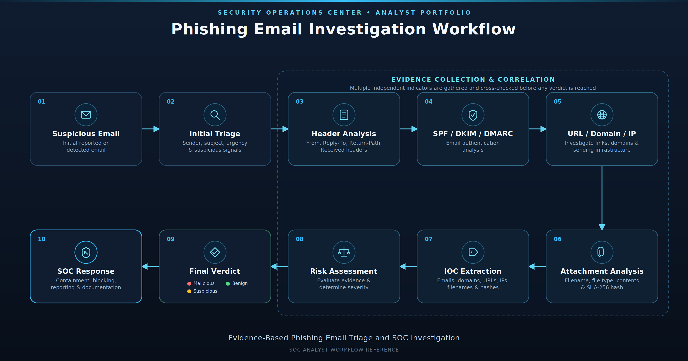

# Phishing Email Triage Lab

A practical SOC-oriented phishing email investigation lab focused on email triage, header analysis, authentication analysis, URL and domain investigation, attachment analysis, IOC extraction, risk assessment, and incident response documentation.

This project simulates a realistic Security Operations Center (SOC) workflow for investigating suspicious emails and documenting analyst findings.

---

## Project Overview

Phishing remains one of the most common initial access techniques used against organizations.

This lab was created to practice the process a SOC analyst would follow when receiving a suspicious email alert or reported phishing message.

Each investigation starts with the available email evidence and progresses through structured analysis before reaching a final verdict.

The project focuses on evidence-based classification rather than assuming that a single indicator automatically determines whether an email is malicious.

---

## Objectives

The main objectives of this project are to demonstrate practical ability in:

* Email triage
* Email header analysis
* Sender and Reply-To analysis
* SPF, DKIM, and DMARC interpretation
* URL and domain analysis
* IP address investigation
* Attachment analysis
* SHA-256 hash collection
* IOC extraction and normalization
* Risk assessment
* Phishing classification
* False-positive analysis
* SOC response recommendations
* Analyst investigation documentation

---

## Investigation Workflow

The investigation process used throughout the lab follows a structured workflow:

```text
Suspicious Email
       |
       v
Initial Triage
       |
       v
Header Analysis
       |
       v
SPF / DKIM / DMARC Analysis
       |
       v
URL / Domain / IP Investigation
       |
       v
Attachment Analysis
       |
       v
IOC Extraction
       |
       v
Risk Assessment
       |
       v
Final Verdict
       |
       v
SOC Response Recommendations
       |
       v
Analyst Documentation
```

The workflow is designed to demonstrate how multiple pieces of evidence should be evaluated together before making a final classification.

---
## Investigation Workflow

The investigation process used throughout the lab follows a structured workflow:



---


## Investigated Cases

Five phishing-email scenarios were investigated and documented.

| Case    | Investigation Type                                | Verdict            | Severity |
| ------- | ------------------------------------------------- | ------------------ | -------- |
| Case 01 | Credential Phishing / Microsoft 365 Impersonation | Malicious          | High     |
| Case 02 | Malicious Attachment / Suspicious Invoice         | Suspicious         | Medium   |
| Case 03 | Microsoft 365 Domain Impersonation                | Confirmed Phishing | High     |
| Case 04 | Business Email Compromise / Payment Fraud         | Confirmed Phishing | High     |
| Case 05 | Benign Invoice / False Positive                   | Benign             | Low      |

### Case 01 - Credential Phishing

Investigates a Microsoft 365 impersonation email containing a deceptive credential-phishing URL.

**Key findings:**

* Suspicious sender and Reply-To relationship
* Authentication failures
* Deceptive login domain
* Credential harvesting risk
* Urgent account-verification language

[View Investigation](cases/case-01-credential-phishing/investigation.md)

---

### Case 02 - Malicious Attachment

Investigates a suspicious invoice email containing a simulated training attachment.

**Key findings:**

* Attachment-based phishing characteristics
* Successful SPF, DKIM, and DMARC authentication
* Attachment identification and SHA-256 hashing
* Risk assessment despite successful authentication

The attachment is a harmless simulated training artifact. It is a plain-text `.txt` file containing no executable or malicious content and was not executed as code.

[View Investigation](cases/case-02-malicious-attachment/investigation.md)

---

### Case 03 - Domain Impersonation

Investigates an email impersonating Microsoft 365 using a deceptive domain.

**Key findings:**

* Successful SPF, DKIM, and DMARC authentication
* Domain impersonation
* Suspicious URL
* Difference between an authenticated sending domain and a legitimate organizational domain

[View Investigation](cases/case-03-domain-impersonation/investigation.md)

---

### Case 04 - Business Email Compromise

Investigates a payment-fraud scenario involving financial instructions and domain inconsistencies.

**Key findings:**

* Urgent payment request
* Payment or banking-detail redirection
* Different Reply-To domain
* Social-engineering indicators
* Financial fraud risk
* Authentication results that do not eliminate the underlying risk

[View Investigation](cases/case-04-bec-payment-fraud/investigation.md)

---

### Case 05 - False Positive

Investigates a legitimate invoice notification that initially appeared suspicious.

**Key findings:**

* Sender and Reply-To alignment
* Consistent domain usage
* No suspicious URL
* No credential request
* No banking-detail change
* Normal accounts-payable workflow
* No significant coercive urgency

The case demonstrates the importance of avoiding false positives by evaluating the complete evidence set rather than relying on one suspicious characteristic.

[View Investigation](cases/case-05-false-positive/investigation.md)

---

## IOC Management

Indicators identified during the investigations are consolidated into a master IOC dataset.

The IOC summary contains:

* Email addresses
* Domains
* URLs
* IP addresses
* Filenames
* SHA-256 hashes
* Invoice identifiers

Indicators are documented using defanged formats where appropriate to prevent accidental interaction with potentially malicious artifacts.

[View Master IOC Summary](iocs/ioc-summary.csv)

---

## Authentication Analysis

The investigations demonstrate that SPF, DKIM, and DMARC results are important evidence but should not be treated as the sole basis for determining whether an email is legitimate.

Examples demonstrated in this lab include:

* Authentication failures supporting a phishing classification
* Fully authenticated emails that remain suspicious
* Authenticated emails using impersonating domains
* Legitimate authenticated email resulting in a false-positive classification

This distinction is important in SOC investigations because authentication verifies aspects of email delivery and domain authorization, not necessarily the legitimacy of the business request or the identity being impersonated.

---

## Skills Demonstrated

### Email Security

* Email header analysis
* Sender and Reply-To analysis
* SPF analysis
* DKIM analysis
* DMARC analysis
* Email authentication interpretation

### Threat Analysis

* Phishing detection
* Credential-phishing identification
* Domain impersonation analysis
* Business Email Compromise analysis
* Social-engineering analysis
* False-positive identification

### IOC Analysis

* IOC extraction
* IOC normalization
* URL analysis
* Domain analysis
* IP analysis
* File hash collection
* SHA-256 identification

### SOC Operations

* Initial triage
* Evidence-based risk assessment
* Incident classification
* Severity assessment
* Analyst documentation
* Response recommendations
* IOC aggregation

---

## Investigation Resources

The project includes a reference list of tools and services relevant to phishing-email investigation and SOC analysis.

These resources are analyst references and were not necessarily used in every investigation case.

[View Investigation Resources](resources/tools.md)

---

## Simulated Training Data

This repository uses intentionally simulated training artifacts for educational purposes.

The `.example` domains and documentation IP addresses are not intended to represent real organizations or malicious infrastructure.

Documentation IP addresses may use reserved ranges such as:

* `192.0.2.0/24`
* `198.51.100.0/24`

These ranges are reserved for documentation and example use.

The project does not contain real malicious infrastructure or real victim information.

---

## Limitations

This lab is designed for controlled training and portfolio demonstration.

The investigations are based on simulated email evidence and do not represent live incident-response cases.

External reputation services, sandbox environments, and live threat-intelligence sources were not required to reach the documented verdicts in these cases.

The project therefore focuses primarily on analyst reasoning, email evidence analysis, IOC handling, and investigation documentation.

---

## Purpose

The purpose of this project is to demonstrate practical phishing-email triage and SOC investigation skills through structured, evidence-based case analysis.

It is intended as a cybersecurity portfolio project for demonstrating foundational capabilities relevant to:

* SOC Analyst
* Security Analyst
* Junior Cybersecurity Analyst
* Email Security Analyst
* Junior Incident Response roles

---

## Disclaimer

This project is intended for educational and defensive cybersecurity training purposes only.

All simulated indicators, domains, IP addresses, email addresses, attachments, and investigation scenarios are provided for controlled training and documentation purposes.

---

## Contact

Github: https://github.com/x-mennn
Linkedin: https://www.linkedin.com/in/vinay-kundu-01602332a/
Email: vinaykundu3007@gmail.com